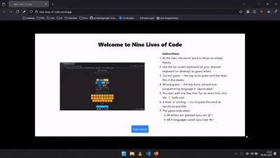

# 🐱 Nine Lives of Code

[](LICENSE)
[](https://reactjs.org/)
[](https://www.typescriptlang.org/)

A hangman-style word game where programming languages pay the price for your wrong guesses.  
Instead of a stick figure, nine languages line up — with each mistake, one gets “deprecated.” 
Guess the word in time, or watch a language vanish from the stack.

## 🎮 Demo



Try it out: [Live Demo](https://nine-lives-of-code.vercel.app/)

## ⚡ Features

-   Hangman mechanics with a coding twist
-   Nine programming languages lined up as “lives”
-   Fast-paced guessing to “save the stack”
-   On-screen + physical keyboard support
-   🎉 Confetti celebrations if you win
-   💀 Ashes fall when you lose
-   ⏱️ Timer shows how long you lasted (time is not saved)
-   💡 Hints system (one free + one extra on demand)
-   🔄 “New Game” button to restart with a fresh word
-   No difficulty levels — one mode fits all

## 🕹️ How to Play

1. The game picks a secret word.
2. You start with one free hint.
3. Guess letters one at a time - via on-screen keyboard or your own keyboard (desktop/laptop).
4. Each wrong guess “deprecates” a programming language.
5. You have 9 wrong guesses before the stack is wiped out.
6. Need help? Press the 💡 bulb icon for another hint.
7. If you win → 🎉 Confetti rains down
8. If you lose → 💀 Ashes fall
9. A timer runs during the round to track how long you take — but results aren’t stored
10. At the end of the game, a **New Game** button appears to let you restart with a new word
11. You can restart the game anytime by clicking on the **Restart** button below the timer.

**⚡ SAVE THE LANGUAGES BEFORE THEY VANISH!**

## 🚀 Getting Started

### Prerequisites

-   Node.js
-   npm

### Installation

```bash
git clone https://github.com/Omkar-Savoikar/nine-lives-of-code.git
cd nine-lives-of-code
npm install
```

### Run the game

```bash
npm start
```

Then open [http://localhost:5173/](http://localhost:5173/) in your browser

## 📂 Project Structure

```plaintext
nine-lives-of-code/
├── docs/                # Demo assets (e.g. GIFs, screenshots)
├── public/              # Static assets
├── src/
│ ├── components/      # React components
│ │ ├── ChipsContainer.tsx
│ │ ├── GameStatus.tsx
│ │ ├── Keyboard.tsx
│ │ ├── Key.tsx
│ │ ├── Loss.tsx
│ │ ├── StartModal.tsx
│ │ ├── Timer.tsx
│ │ ├── Word.tsx
│ │ └── Main.tsx     # Main game container
│ ├── lib/           # Game logic & utilities
│ │ ├── languages.ts # List of programming languages
│ │ └── words.ts     # Word + hint provider
│ ├── App.tsx        # Root component
│ └── index.tsx      # Entry point
├── package.json
└── vite.config.ts
```

This structure keeps UI components isolated from game logic, making the project easier to scale and maintain.

## 🛠️ Tech Stack

-   ⚛️ React (with hooks & component-driven design)
-   🟦 TypeScript (type safety + maintainability)
-   ⚡ Vite (fast dev + build)

## 🗺️ Roadmap

-   [ ] Mobile responsiveness
-   [ ] Pause the timer if user switches tab for more than 2 mins
-   [ ] Update tab title when user is away
-   [ ] Dificulty levels (Easy / Medium / Hard)
-   [ ] Leaderboard with fastest completion times
-   [ ] Theming (light/dark mode)
-   [ ] Show users know how many players they've beaten

## 📖 About This Project

I built Nine Lives of Code while following a Scrimba course to sharpen my React and TypeScript skills.
The goal was to take the classic Hangman game and reimagine it with a programming twist — replacing the stick figure with nine coding languages.

This project helped me practice:

-   State management and component-driven design in React
-   Handling timers and animations with **useEffect** and **useRef**
-   Thinking about user experience details (celebrations, game-over effects, reset flow)
-   Writing clean, maintainable TypeScript code

It’s not just a game — it’s also a reflection of my learning journey.

## 📜 License

Distributed under the MIT License. See [LICENSE](LICENSE)

## 🙌 Credits

-   Inspired by the classic game Hangman.
-   Built as part of a [Scrimba's Learn React](https://scrimba.com/learn-react-c0e) course project.
-   Special thanks to [Bob Ziroll](https://x.com/bobziroll) for creating the course and guidance.

## 🤝 Contributions

This project was built as a course project and is not open for external contributions.
Feel free to fork it for your own learning or experiments!
